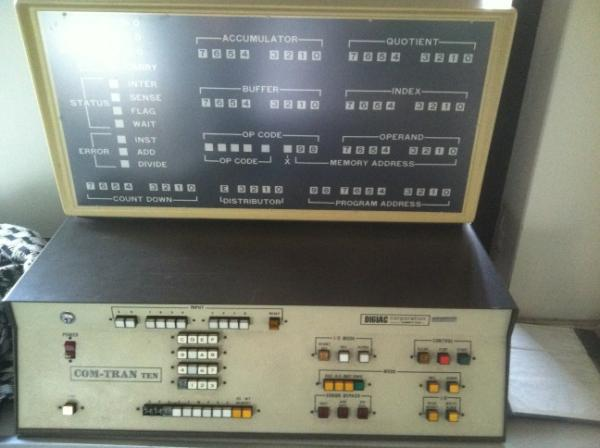
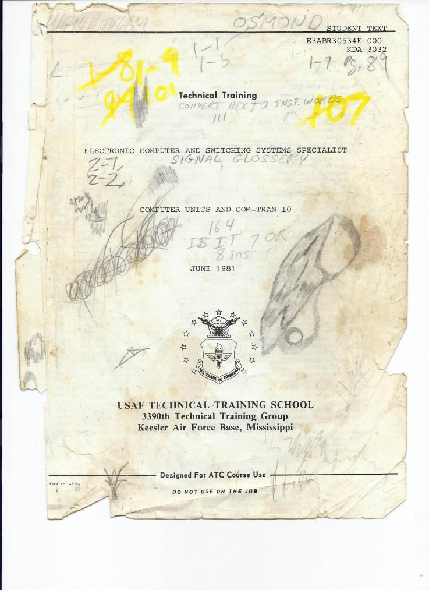

# CT-10 (COM-TRAN TEN) Emulator

This repository builds an emulator of the Digiac COM-TRAN TEN (CT-10).

The CT-10 was a training device. It existed solely to teach digital computer fundamentals and Navy-specific maintenance concepts to enlisted technical personnel.

This emulator reproduces the original front panel, instruction timing, and internal data paths with high fidelity. It is a **behavioral digital twin**, not a high-level or abstract CPU model.

This project is **Part 1** of a longer series of tools intended to emulate historic military computing and training systems as accurately as possible using publicly available training sources.

---

## Project scope and long-term intent

The CT-10 emulator is the first in a planned series whose goals are:

- Preservation of historically significant military training computers.
- Museum-quality demonstration and education.
- Faithful reconstruction of registers, buses, clocks, and execution phases.

No proprietary firmware or restricted technical manauls are used.

---

## Historical context

The Digiac COM-TRAN TEN was designed and sold as an **educational and training computer**. Within the U.S. military, it was used to support the transition from analog and electromechanical control systems to digital computers.

Documented usage includes:

- **U.S. Navy enlisted technical training**, particularly for the Data Systems Technician (DS) rating.
- **U.S. Air Force technical training**, earlier in the system’s service life.

The CT-10 was not connected to operational combat systems and did not process live tactical data. Its value was pedagogical.

Primary training and reference material includes:

- *COM-TRAN TEN Logic Diagrams for Combat Systems Advanced Digital A-100-0142 (Volume 4)*, Service School Command, Great Lakes, Illinois, prepared for the Chief of Naval Education and Training (September 1995).
- *Student Guide for Data Systems Technician Class A Phase Two A-150-0025, Volume II (Part 3)*, Combat Systems Technical Schools Command, Mare Island, California (01 April 1991).
- *Electronic Computer and Switching Systems Specialist: Computer Units and COM-TRAN 10*, USAF Technical Training School, 3380th Technical Training Group, Keesler Air Force Base (June 1981).

Source copies are preserved in `Docs/Historical/`.

---

## U.S. Navy Data Systems Technician (DS) rating history

The **Data Systems Technician (DS)** rating was established by the U.S. Navy in **1965** to support the rapid introduction of digital computers into combat systems, command-and-control, and weapons coordination.  It was disestablished in 1998 and its members were split between the Electronics Technician (ET) and Fire Controlman (FC) ratings.  The vast majority of those who worked on combat systems computing were converted to FC.  

### Origins

The DS rating consolidated responsibilities previously spread across electronics and fire control specialties. Early DS sailors were trained to maintain, troubleshoot, and align digital computers used in naval tactical systems.

Training emphasized:

- Digital logic and arithmetic
- Memory systems
- Timing and synchronization
- Input/output devices

Training computers such as the COM-TRAN TEN provided a safe, inspectable environment for learning these concepts without risk to operational systems.

Primary references include Bureau of Naval Personnel and Naval Education and Training Command material, including early editions of:

- *NAVPERS 18068 – Manual of Navy Enlisted Manpower and Personnel Classifications*
- *NEETS Module 20 – Digital Computers*

### Training pipeline

By the 1970s–1990s, DS training typically included:

1. Basic electronics instruction
2. DS Class A School
3. Platform- and system-specific follow-on training

The COM-TRAN TEN appears explicitly in DS Class A and Phase II curricula at Mare Island and Great Lakes as a **training-only instructional computer**.


Primary references include:

- *NAVADMIN 197/96 – Enlisted Rating Merger Plan*
- Post-1997 *Navy Enlisted Classification (NEC) Manuals*

---

## Device capabilities (as documented)

Based strictly on original training documentation:

- 8-bit word architecture
- Registers: Accumulator (A), Quotient (Q), Index (X), Countdown (C), Buffer (B)
- 1024 memory cells (0x000–0x3FF)
- Two memory cells per instruction word
- 44 instructions across load, store, arithmetic, logical, branch, and I/O classes
- Two-phase instruction cycle: Acquisition and Execution
- Physical control panel supporting manual memory entry and distributor stepping

Primary source: `Docs/Historical/KDA-3032_Digiac_COM-TRAN_TEN_Training_Jun81 ct10 ct-10.pdf`

---

## Emulator goals and fidelity targets

- Cycle-accurate timing using CP1 / CP2 / CP3 clocks
- Explicit modeling of registers, buses, and control signals
- Deterministic state transitions
- UI modeled directly after the physical CT-10 panel
- Adjustable execution speed (1× to 10×)
- Headless execution for regression testing and trace comparison

Architectural intent is documented in:

- `Docs/Architecture/CT10_Emulator_PRD.md`
- `Docs/Architecture/ARCHITECTURE.md`
- `Docs/Architecture/TIMING_MODEL.md`

---

## Build and run

Requirements:

- CMake 3.20+
- C++20 compiler
- OpenGL
- Internet access for FetchContent (GLFW, Dear ImGui)
- Primarily designed to run on OSX.  There is nothing in the codebase that would prevent it from running on other platforms but it hasn't been tested or built on them.

```bash
./scripts/build.sh
```

Run the UI emulator:

```bash
./build/ct10
```

Run the headless core:

```bash
./build/ct10_headless
```

---

## Images

Front elevation and reference photos:






Emulator UI:


---

## Dependencies and licenses

- Dear ImGui — MIT License
- GLFW — zlib/libpng License
- OpenGL — Khronos API (system library)
- CMake — BSD-3-Clause

## Development

- This was a project to see what chatgpt and codex put together could do easily.  Nearly everything in this codebase was written by Codex and designed by chatgpt, with architectural hints from me.  The UI had to be heavily manually aligned -- even with screenshots codex was not able to get it right.  
- It is unlikely I will put any more time into this, but if anyone has programs they want to run on it and finds issues, feel free to open a PR w/ the text of the program and expected output and I'll take a look.
- Additional test programs are also welcome as a PR to this project.

---

## Contributing

- Fork the repository and create a feature branch for your changes.
- Submit a pull request with a clear description of your changes and their purpose.
- AI generated code is **explicitly allowed** in this project.  Review it first to make sure it makes sense.  

---

## License

This project is licensed under the MIT License - see the LICENSE file for details.
